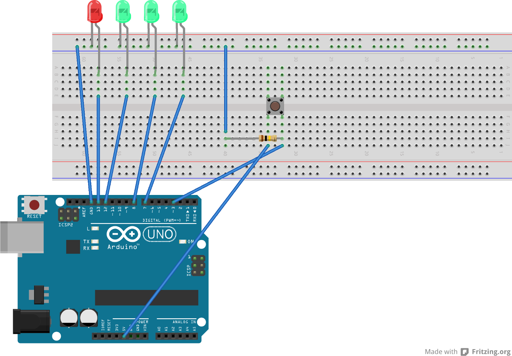
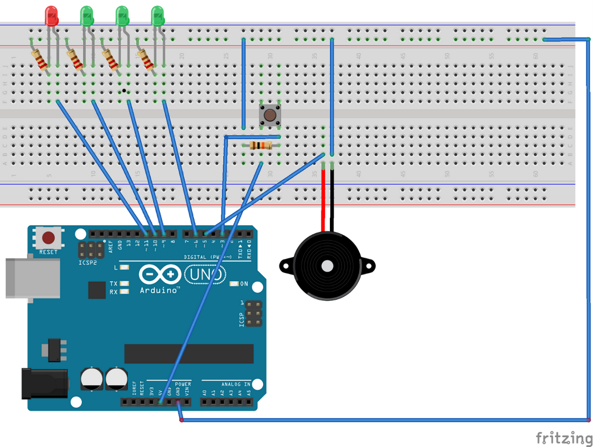

A device to time control for the table Intelect  game (Scrabble).

####Idea

The game need a control time to count 40 seconds, the time  of each player for think of a word.

---
######Version A

When a player´s turn begins one LED switch on every 10 seconds. When the time arrive to 30seg the red LED swith on and when the time over all LED flash until other player push the buttom to reset the timer.

---

######Version B

